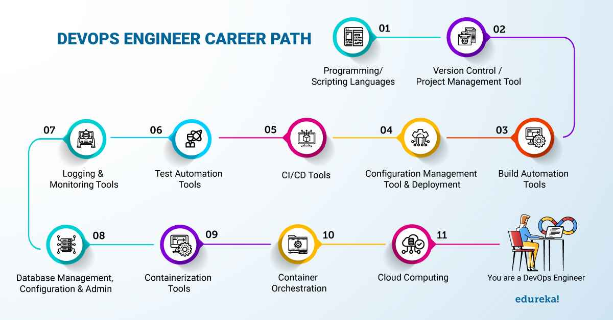

# Learn Devops using free Resources :memo:

This is a step-by-step guide on how to become a DevOps engineer, with links to free resources.

> Resources include Books, Videos, Articles and Interactive Sessions

_Don't forget to leave a star on our repository! :star:_

## Navigation

#### 1. [Version Control - Git](#git)

#### 2. [Linux and Bash Scripting](#linux)

#### 3. [Learn a Programming Language](#Learn-a-Programming-Language)

## Git

Git  is a distributed version control system that tracks changes in any set of computer files, usually used for coordinating work among programmers who are collaboratively developing source code during software development. Its goals include speed, data integrity, and support for distributed, non-linear workflows (thousands of parallel branches running on different computers).

#### Books

[Pro Git book, written by Scott Chacon and Ben Straub](https://git-scm.com/book/en/v2 "Pro Git book, written by Scott Chacon and Ben Straub")

[A Hacker’s Guide to Git by Joseph Wynn](https://wildlyinaccurate.com/a-hackers-guide-to-git/#git-stash "A Hacker’s Guide to Git by Joseph Wynn")

[Conversational Git by Alan Hohn](https://alanhohn.com/extras/conversational-git/ "Conversational Git by Alan Hohn")

[Git In the Trenches by Peter Savage](https://cbx33.github.io/gitt/ "Git In the Trenches by Peter Savage")

[Getting Git right](https://www.atlassian.com/git)

#### Videos

[Version Control with Git by Atlassian](https://www.coursera.org/learn/version-control-with-git?irclickid=VE2T4fw%3AmxyPW7sy9HXbxzWgUkFTP21JmxUy2M0&irgwc=1&utm_medium=partners&utm_source=impact&utm_campaign=3294490&utm_content=b2c)

[Git and GitHub for Beginners - Crash Course](https://www.youtube.com/watch?v=RGOj5yH7evk)

[Git Tutorial for Beginners: Learn Git in 1 Hour](https://www.youtube.com/watch?v=8JJ101D3knE)

[Git Tutorial By GitKraken](https://www.gitkraken.com/learn/git/tutorials)

#### Interactive Tutorial

[Interactive Guide to Git Branching](https://learngitbranching.js.org/)

## Linux

Linux is an operating system. In fact, one of the most popular platforms on the planet, Android, is powered by the Linux operating system. An operating system is software that manages all of the hardware resources associated with your desktop or laptop. To put it simply, the operating system manages the communication between your software and your hardware. Without the operating system (OS), the software wouldn’t function.

#### Books

[The Ultimate Linux Newbie Guide](/The-Ultimate-Linux-Newbie-Guide-eBook-Edition.pdf "The Ultimate Linux Newbie Guide")

[The Linux Command Line](/The%20Linux%20Command%20Line.pdf "The Linux Command Line")

[Linux Fundamentals](/linuxfundamentals.pdf "Linux Fundamentals")

[Introduction to Bash Scripting by Bobby Iliev](https://github.com/bobbyiliev/introduction-to-bash-scripting "Introduction to Bash Scripting by Bobby Iliev")

[Bash Notes for Professionals](/BashNotesForProfessionals.pdf "Bash Notes for Professionals")

#### Videos

[The “Start From Scratch” Linux Course](https://www.netacad.com/courses/os-it/ndg-linux-unhatched?ref=itsfoss.com "The “Start From Scratch” Linux Course")

[LinuxFoundationX: Introduction to Linux](https://www.edx.org/learn/linux/the-linux-foundation-introduction-to-linux?ref=itsfoss.com "LinuxFoundationX: Introduction to Linux")

[RedHat: Fundamentals of Red Hat Enterprise Linux](https://www.edx.org/learn/linux/red-hat-fundamentals-of-red-hat-enterprise-linux?ref=itsfoss.com "RedHat: Fundamentals of Red Hat Enterprise Linux")

[Bash Scripting Tutorial for Beginners](https://www.youtube.com/watch?v=tK9Oc6AEnR4 "Bash Scripting Tutorial for Beginners")

[Advanced Bash Scripting Tutorial](https://www.youtube.com/watch?v=emhouufDnB4 "Advanced Bash Scripting Tutorial")

#### Interactive Tutorial

[Linux Journey](https://linuxjourney.com/ "Linux Journey")

[Linux Survival](https://linuxsurvival.com/ "Linux Survival")

[Webminal](https://www.webminal.org/ "Webminal")

[https://web.mit.edu/mprat/Public/web/Terminus/Web/main.html](https://web.mit.edu/mprat/Public/web/Terminus/Web/main.html "https://web.mit.edu/mprat/Public/web/Terminus/Web/main.html")

[OverTheWire bandit](https://overthewire.org/wargames/bandit/bandit17.html "OverTheWire bandit")

## Learn a Programming Language

DevOps promotes teamwork, communication, and continual improvement. As a result, DevOps engineers must master specialized programming and scripting languages in order to expedite enhanced product releases and deliver them more frequently.

This means that a skilled DevOps engineer must be fluent in numerous programming or scripting languages. Furthermore, the more coding languages you know, the better you'll be at optimizing procedures and efficiently constructing software.

We have opted for Python and Go as our preferred programming languages for this purpose.

#### Books :book:

Python :snake:

[Python101](https://python101.pythonlibrary.org/ "Python101")

[Slither Into Python + Slither Into Data Structures and Algorithms](https://www.slitherintopython.com/ "Slither Into Python + Slither Into Data Structures and Algorithms")

[The Python Coding Book](https://thepythoncodingbook.com/ "The Python Coding Book")

Go 

[Go Bootcamp by Matt Aimonetti](/GoBootcamp.pdf "Go Bootcamp by Matt Aimonetti")

[An Introduction to Programming in Go by Caleb Doxsey](https://www.golang-book.com/ "An Introduction to Programming in Go by Caleb Doxsey")

[Go for DevOps By John Doak , David Justice](https://www.packtpub.com/product/go-for-devops/9781801818896 "Go for DevOps By John Doak , David Justice")

#### Videos :computer:

Python

[Python Tutorial - Python Full Course for Beginners by Programming with Mosh](https://www.youtube.com/watch?v=_uQrJ0TkZlc "Python Tutorial - Python Full Course for Beginners by Programming with Mosh (Youtube)")

[Python for Beginners – Full Course [Programming Tutorial]](https://www.youtube.com/watch?v=eWRfhZUzrAc "Python for Beginners – Full Course [Programming Tutorial]")

Go

[Learn Go Programming - Golang Tutorial for Beginners](https://www.youtube.com/watch?v=YS4e4q9oBaU "Learn Go Programming - Golang Tutorial for Beginners")

[Go Programming – Golang Course with Bonus Projects](https://www.youtube.com/watch?v=un6ZyFkqFKo "Go Programming – Golang Course with Bonus Projects")

[Programming with Google Go Specialization](https://www.coursera.org/specializations/google-golang?irclickid=VE2T4fw%3AmxyPW7sy9HXbxzWgUkFTZa1dmxUy2M0&irgwc=1&utm_medium=partners&utm_source=impact&utm_campaign=3294490&utm_content=b2c "Programming with Google Go Specialization")

[Go / Golang Crash Course](https://www.youtube.com/watch?v=SqrbIlUwR0U "Go / Golang Crash Course")

[Learn Go](https://www.codecademy.com/learn/learn-go?periods=year&plan_id=proGoldAnnualV2&utm_source=pepperjam&utm_medium=affiliate&utm_term=225746&clickId=4536129920&pj_creativeid=8-12462&pj_publisherid=225746)

#### Interactive Tutorial :play:

Python

[Learn Python](https://www.learnpython.org/ "Learn Python")

[Learn Python with Olof Paulson](https://scrimba.com/learn/python "Learn Python with Olof Paulson")

[Python Tutorial by W3schools](https://www.w3schools.com/python/ "Python Tutorial by W3schools")

[Google's Python Class](https://developers.google.com/edu/python "Google's Python Class")

Go

[A Tour of Go](https://go.dev/tour/welcome/1 "A Tour of Go")

[https://www.learn-golang.org/](https://www.learn-golang.org/ "https://www.learn-golang.org/")

## Licence

