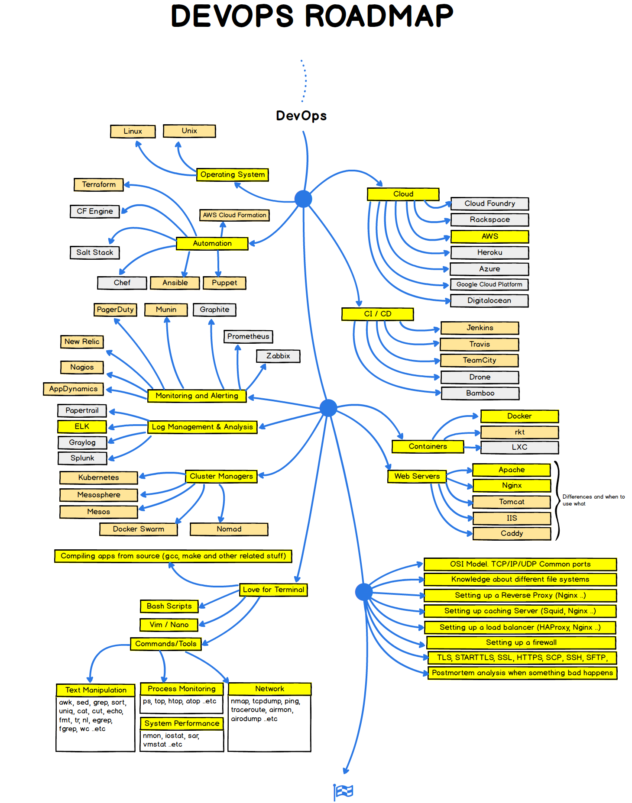

# Learn Devops using free Resources :memo:

This is a step-by-step guide on how to become a DevOps engineer, with links to free resources.

> Resources include Books, Videos, Articles and Interactive Sessions

_Don't forget to leave a star on our repository! :star:_

## Navigation

#### 1. [Git](#git)

#### 2. [Linux](#linux)

## Git

Git  is a distributed version control system[9] that tracks changes in any set of computer files, usually used for coordinating work among programmers who are collaboratively developing source code during software development. Its goals include speed, data integrity, and support for distributed, non-linear workflows (thousands of parallel branches running on different computers).

##### Books

[Pro Git book, written by Scott Chacon and Ben Straub](https://git-scm.com/book/en/v2 "Pro Git book, written by Scott Chacon and Ben Straub")

[A Hacker’s Guide to Git by Joseph Wynn](https://wildlyinaccurate.com/a-hackers-guide-to-git/#git-stash "A Hacker’s Guide to Git by Joseph Wynn")

[Conversational Git by Alan Hohn](https://alanhohn.com/extras/conversational-git/ "Conversational Git by Alan Hohn")

[Git In the Trenches by Peter Savage](https://cbx33.github.io/gitt/ "Git In the Trenches by Peter Savage")

[Getting Git right](https://www.atlassian.com/git)

##### Videos

[Version Control with Git by Atlassian](https://www.coursera.org/learn/version-control-with-git?irclickid=VE2T4fw%3AmxyPW7sy9HXbxzWgUkFTP21JmxUy2M0&irgwc=1&utm_medium=partners&utm_source=impact&utm_campaign=3294490&utm_content=b2c)

[Git and GitHub for Beginners - Crash Course](https://www.youtube.com/watch?v=RGOj5yH7evk)

[Git Tutorial for Beginners: Learn Git in 1 Hour](https://www.youtube.com/watch?v=8JJ101D3knE)

[Git Tutorial By GitKraken](https://www.gitkraken.com/learn/git/tutorials)

#### Interactive

[Interactive Guide to Git Branching](https://learngitbranching.js.org/)

## Linux

##### Books

[The Ultimate Linux Newbie Guide](/)

##### Videos

[The “Start From Scratch” Linux Course](https://www.netacad.com/courses/os-it/ndg-linux-unhatched?ref=itsfoss.com "The “Start From Scratch” Linux Course")

[LinuxFoundationX: Introduction to Linux](https://www.edx.org/learn/linux/the-linux-foundation-introduction-to-linux?ref=itsfoss.com "LinuxFoundationX: Introduction to Linux")

[RedHat: Fundamentals of Red Hat Enterprise Linux](https://www.edx.org/learn/linux/red-hat-fundamentals-of-red-hat-enterprise-linux?ref=itsfoss.com "RedHat: Fundamentals of Red Hat Enterprise Linux")

##### Interactive

[Linux Journey](https://linuxjourney.com/ "Linux Journey")